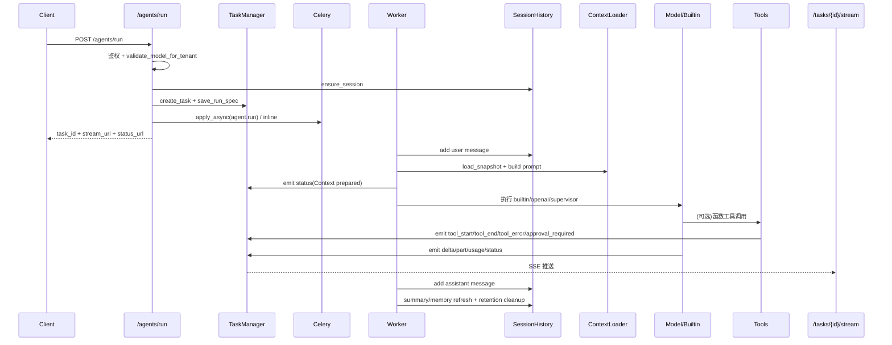
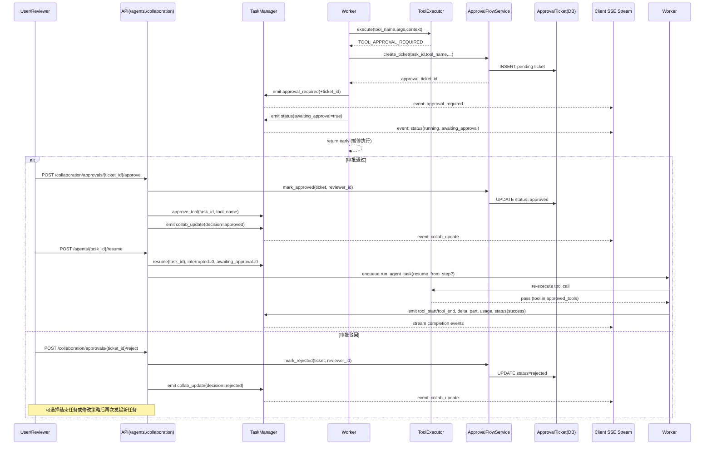

# Agent 全流程与框架梳理

本文档只聚焦当前后端仓库中的 Agent 运行机制，覆盖：

- 多轮对话上下文管理
- 工具调用与治理
- 单 Agent / Supervisor 多阶段执行
- 实时事件协议（SSE）
- 鉴权与租户隔离
- 可观测性、可靠性与验证方案

---

## 1. 总体架构（按运行链路）

核心链路：

1. 客户端调用 `POST /api/v1/agents/run`（`app/api/v1/agents.py`）。
2. API 层完成鉴权、模型策略校验、会话准备、任务创建。
3. 任务进入 Celery（或测试环境内联执行）并进入 `app/worker/tasks.py::_run_agent_task`。
4. Worker 写入用户消息，加载多轮上下文快照，选择执行路径：
   - `builtin`：本地技能 `SimpleAgent`
   - 非 `builtin`：OpenAI Agents 流式桥接
   - `supervisor/orchestrator`：多步骤工作流
5. 运行期间通过 `TaskManager.emit` 持续推送标准化事件到内存或 Redis Stream。
6. 客户端通过 `GET /api/v1/tasks/{task_id}/stream` 订阅 SSE，实时获取 `status/delta/part/usage/...`。
7. 任务结束后写回 assistant 消息，触发摘要/记忆刷新与保留策略清理。

---

## 2. 关键模块与职责边界

### 2.1 API 接入层

- `app/api/v1/agents.py`
  - `/agents/run`：创建任务与运行规范（run spec）
  - `/agents/{task_id}`：查状态
  - `/agents/{task_id}/resume`：恢复执行（支持从步骤恢复 + 工具审批）
- `app/api/v1/tasks.py`
  - `/tasks/{task_id}/stream`：SSE 事件流
  - `/tasks/{task_id}/cancel`：中断任务
- `app/api/deps.py`
  - 从 Bearer Token 获取用户
  - 从 `X-Tenant-ID`、`X-Trace-ID` 注入租户与链路追踪

### 2.2 调度与状态层

- `app/services/task_manager.py`
  - 任务状态机（queued/running/success/failed/cancelled）
  - 事件存储与推流（test 环境内存；非 test 用 Redis Stream）
  - 中断、恢复、重试计数、死信、审批工具缓存、checkpoint

### 2.3 Agent 执行层

- `app/worker/tasks.py`
  - `_run_agent_task`：主入口
  - `_run_openai_stream_task`：OpenAI Agent 流式执行 + 工具桥接
  - `_run_supervisor_workflow`：分步骤编排、超时重试、checkpoint
- `app/agent/factory.py`
  - `SimpleAgent`（内置技能执行，按空格拆分产生 delta）
- `app/agent/openai_adapter.py`
  - 兼容 `agents.Runner.run` 与 `run_streamed` 的桥接封装

### 2.4 多轮上下文层

- `app/services/session_history.py`
  - 会话/消息/摘要/KV 记忆读写
  - token 估算、摘要触发、保留策略（归档与过期清理）
- `app/services/context_loader.py` + `app/services/prompt_builder.py`
  - 将系统指令、租户策略、摘要、KV、recent messages、当前输入组装为模型输入快照

### 2.5 工具层

- `app/tools/registry.py`：`ToolSpec` 注册中心（schema、权限、超时、风险、租户可用性）
- `app/tools/executor.py`：统一执行器（校验、超时、guardrail、审批门禁）
- `app/tools/runtime.py`：将内部工具包装为 OpenAI Agents function tool，并发射 `tool_*` 事件
- `app/tools/__init__.py`：默认工具注册（`time_now`、`session_lookup`、`summarize_chunk`、`http_search_wrapper`、`mcp_proxy_call`）

---

## 3. 端到端详细流程（单次 run）



补充说明：

- API 返回即异步，不等待最终结果。
- SSE 支持 `Last-Event-ID` 断线重连回放（`tasks.py` + `TaskManager.stream_events`）。
- 若任务被取消，Worker 在多个执行点主动查询 `task_manager.cancelled(task_id)` 后结束。

---

## 4. 多轮对话（Session）如何参与 Agent 推理

### 4.1 上下文分层

`PromptBuilder` 使用 token budget 做分桶（system/summary/memory/recent），产出 `AgentContextSnapshot`：

1. System + tenant policy 指令
2. 最新摘要（summary）
3. KV 记忆（memory）
4. 最近消息（recent messages）
5. 当前用户消息

并携带：

- `context_budget_used`
- `input_tokens_by_layer`
- `trimmed_items_count`
- `summary_hit` / `kv_hit`
- `summary_version`

这些指标会被附加到运行事件，便于前端和运维侧定位“上下文是否被截断、命中情况如何”。

### 4.2 会话数据闭环

每次任务：

1. 先写入 user 消息；
2. 执行完成后写入 assistant 消息；
3. 达到阈值时异步刷新 summary 和记忆；
4. 执行 retention（归档旧消息、限制摘要版本、清理过期 KV）。

因此多轮对话不是“仅拼接聊天记录”，而是“摘要 + 记忆 + recent”混合检索式输入。

---

## 5. Agent 执行模式

### 5.1 Builtin 模式

触发条件：`model == "builtin"` 且非 supervisor。

- 从 `agent_type -> skill`（`agent/tool_bindings.py` + `agent/skills.py`）解析；
- 通过 `SimpleAgent.run()` 生成 `delta`、`part(final_text)`、`usage`、`status`；
- 适合本地可控逻辑、开发联调和降级兜底。

### 5.2 OpenAI Agents 模式

触发条件：`model != "builtin"` 且非 supervisor。

- 调 `stream_openai_agents` 流式消费事件；
- 每个 chunk 通过 `on_delta` 写入 `delta` 事件；
- 结束后发 `part(final_text)` + `usage` + `status(success)`；
- 若工具审批未通过，发 `awaiting_approval` 状态，等待 resume。

### 5.3 Supervisor/Orchestrator 模式

触发条件：`agent_type in {"supervisor", "orchestrator"}`。

- 优先从 checkpoint 恢复 `plan_created`/`plan_recomputed`；无 plan 时才 `build_plan()`；
- 每步记录 checkpoint（started/completed/timeout）；
- 发 `handoff_start/handoff_end`，体现“主控 -> worker -> 主控”；
- 每步支持 timeout + retry，超过重试阈值则 fail；
- 支持 `resume_from_step` 从中间步骤恢复。

Supervisor 编排（多步骤 + timeout/retry/checkpoint/resume）详细时序：

```mermaid
sequenceDiagram
  participant C as Client
  participant API as /agents/run|resume
  participant TM as TaskManager
  participant W as Worker(_run_supervisor_workflow)
  participant CP as Checkpoint Store
  participant WA as WorkerAgent(LLM/Builtin)
  participant SSE as Client SSE Stream

  C->>API: POST /agents/run (agent_type=supervisor)
  API->>TM: create_task + save_run_spec
  API->>W: enqueue run_agent_task
  W->>W: load_plan_from_checkpoints or build_plan() -> steps[]
  W->>TM: list_checkpoints(task_id)
  TM-->>W: completed_from_state
  W->>W: start_idx = completed_from_state

  loop for step = start_idx .. len(steps)-1
    W->>TM: save_checkpoint(step_started)
    W->>SSE: emit checkpoint_saved
    W->>SSE: emit handoff_start

    loop attempt <= step_max_retries
      W->>WA: execute subtask (with timeout)
      alt 执行成功
        WA-->>W: step_output
        W->>TM: save_checkpoint(step_completed, output_preview)
        W->>SSE: emit checkpoint_saved + handoff_end
        break 本步骤重试循环
      else 超时
        WA--xW: TimeoutError
        W->>TM: save_checkpoint(step_timeout, attempt)
        W->>SSE: emit step_timeout(retry_count/max_retries)
        alt 仍可重试
          W->>W: backoff 后重试
        else 超过重试上限
          W->>SSE: emit status(failed, Step timeout after retries)
          W-->>API: workflow end (failed)
        end
      else 其他异常
        WA--xW: Exception
        alt 仍可重试
          W->>W: backoff 后重试
        else 超过重试上限
          W->>SSE: emit status(failed, Step failed)
          W-->>API: workflow end (failed)
        end
      end
    end
  end

  W->>SSE: emit part(final_text)
  W->>SSE: emit status(success, workflow_step=len(steps))

  opt 从中间恢复
    C->>API: POST /agents/{task_id}/resume (resume_from_step = N)
    API->>TM: resume(task_id) + load run_spec
    API->>W: enqueue run_agent_task(resume_from_step=N)
    W->>TM: list_checkpoints
    W->>W: start_idx = max(N, completed_from_state)
    Note over W: 仅重跑 N 及之后步骤
  end
```

---

## 6. 工具调用全链路与治理

### 6.1 绑定与暴露

- `resolve_agent_tool_binding(agent_type)` 决定该 Agent 允许候选工具；
- 结合 `ToolRegistry.is_allowed_for_tenant` 再做租户级过滤；
- 过滤掉的工具会发送 `tool_error(TOOL_NOT_ALLOWED_FOR_TENANT)` 事件。

### 6.2 执行控制

`ToolExecutor.execute` 在真正调用前做六层防线：

1. 工具存在性校验
2. 租户可用性校验
3. 权限校验（`required_permissions`）
4. 输入 guardrail 拦截（敏感模式）
5. 审批门禁（高风险或配置要求审批）
6. 输入 schema 校验

执行后再做：

- 超时控制
- 运行时异常转换
- 输出 schema 校验

### 6.3 事件协议

运行时会产生：

- `tool_start`
- `tool_end`
- `tool_error`
- `approval_required`

前端可据此构建“工具调用时间线 + 参数预览 + 错误定位 + 人工审批”交互。

---

## 7. 协作与审批（Human-in-the-loop）

`app/api/v1/collaboration.py` 提供：

- 任务交接：`/collaboration/tasks/{task_id}/handoff`
- 工具预审批：`/collaboration/tasks/{task_id}/approve-tool`
- 审批单查询：`/collaboration/tasks/{task_id}/approvals`
- 审批通过/驳回：`/collaboration/approvals/{ticket_id}/approve|reject`

当工具需要审批时：

1. Worker 发 `approval_required`；
2. `ApprovalFlowService` 创建 `approval_ticket`；
3. 审批人通过后，工具名写入 `approved_tools`；
4. 调 `/agents/{task_id}/resume`，继续执行。

审批/恢复分支详细时序：



---

## 8. 实时事件模型（SSE 协议）

事件类型定义在 `app/schemas/realtime.py`，包括：

- 结果流：`status`, `delta`, `part`, `usage`
- 工具流：`tool_start`, `tool_end`, `tool_error`, `approval_required`
- 编排流：`handoff_start`, `handoff_end`, `step_timeout`, `checkpoint_saved`
- 协作流：`collab_update`

SSE 特性：

- 标准格式：`id/event/data`
- 心跳注释防超时
- 终态（success/failed/cancelled）自动结束流
- `Last-Event-ID` 回放断线区间

---

## 9. 可靠性与可观测性

### 9.1 可靠性

- Celery 失败重试：指数退避（`_handle_retry_or_deadletter`）
- 超过最大重试：标记 poison + 进入 dead-letter
- TaskState 维护：`retry_count`, `failure_reason`, `poison`, `interrupted`

### 9.2 可观测性

- `trace_id` 在 API -> Worker -> Event -> Session 全链路透传
- telemetry span：
  - `agent.run`
  - `tool.execute`
- Admin 诊断接口：
  - 队列深度、worker 健康、任务诊断、死信、工具清单、metrics、alerts

---

## 10. 验证与测试建议（实现验证）

### 10.1 当前已存在自动化验证

测试文件：`tests/test_realtime_and_agents.py`

- `test_task_stream_and_cancel`
  - 验证任务创建、SSE 事件可读、取消后状态正确
- `test_agent_protocol_events`
  - 验证 Agent 事件协议至少覆盖 `status/delta/part/usage`

本地执行命令：

```bash
uv run pytest tests/test_realtime_and_agents.py -q
```

### 10.2 建议新增验证用例（按优先级）

1. `supervisor` 的 timeout/retry/checkpoint/resume 分支覆盖
2. 工具审批链路：`approval_required -> approve -> resume`
3. tenant tool policy/model policy 的拒绝路径（403/400）
4. `Last-Event-ID` 的回放一致性与幂等性
5. dead-letter 触发后的 admin 诊断可见性
6. session retention（消息归档、summary 版本裁剪、KV 过期）行为验证

---

## 11. 一句话结论

当前 Agent 框架是“任务化 + 事件流 + 多层上下文 + 受控工具执行 + 人工审批恢复”的后端实现：既支持基础对话，也支持可治理的多阶段智能工作流，并具备生产化所需的观测与容错骨架。

