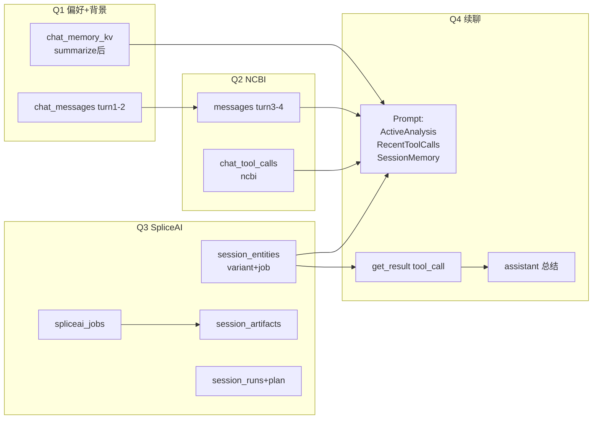
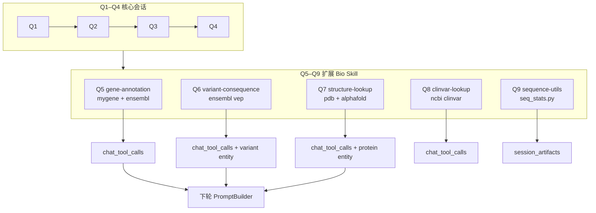

# Demo Query 逐步生成流程（Query → 步骤 → 产出）

本文档按 **每条 Demo Query** 展开：**输入什么 → 经过哪一步 → 生成什么 → 下一步用到什么**。  
配套脚本：[scripts/demo_session_flow.py](../scripts/demo_session_flow.py) · 操作手册：[demo-session-flow-zh.md](./demo-session-flow-zh.md)

---

## 0. 共用前提

| 项 | 值 |
|----|-----|
| session_id | 九轮共用同一个，例如 `sess-abc` |
| tenant | `public` / `lab-a` |
| 每轮 API | `POST /api/v1/agents/run` → 返回 `task_id` |

**单轮通用骨架（所有 Query 都走）：**

```
Client                    API (FastAPI)              Worker (Celery)              存储
  │                            │                          │                        │
  │ POST /agents/run           │                          │                        │
  │───────────────────────────>│ ensure_session           │                        │
  │                            │─────────────────────────────────────────────────>│ PG: chat_sessions
  │                            │ enqueue run_agent_task   │                        │
  │                            │─────────────────────────>│                        │
  │                            │                          │ add user message       │ PG: chat_messages
  │                            │                          │ create_session_run     │ PG: session_runs (running)
  │                            │                          │ save_run_spec          │ Redis: task:{id}:run_spec
  │                            │                          │ ContextLoader 读历史   │ PG 读 messages/summary/kv/entities/tool_calls
  │                            │                          │ PromptBuilder 拼 prompt│ snapshot (内存)
  │                            │                          │ emit Context prepared  │ Redis SSE; kv_hit/summary_hit
  │                            │                          │ LLM / supervisor / 工具│ 见各 Query 差异
  │                            │                          │ add assistant msg    │ PG: chat_messages + metadata
  │                            │                          │ complete_session_run   │ PG: session_runs (success)
  │ GET /tasks/{task_id}       │                          │                        │
  │<───────────────────────────│                          │                        │
  │ (可选) refresh memory      │                          │ summarize task         │ PG: summary + memory_kv
```

---

## Q1 — 会话偏好 + 变异背景

### Query

```
genome_build: GRCh38
report_language: 中文

请用 2-3 句话介绍剪接位点变异 NM_000518.5:c.694+1G>A 的一般分析思路。
```

`agent_type=research`，`model=deepseek-chat`（或 `builtin` smoke）

### 逐步生成

| 步骤 | 组件 | 做什么 | **生成 / 更新** | 下一步谁用 |
|------|------|--------|-----------------|------------|
| **1** | API `POST /agents/run` | 校验 model/tenant，绑定 session | Redis `task:{id}:state` status=queued | Client 轮询 task_id |
| **2** | Worker 入口 | `add_message(role=user)` | PG `chat_messages` turn=1, content=整段 Query | ContextLoader 读 recent_messages |
| **3** | Worker | `create_session_run` | PG `session_runs` id=task_id, status=**running**, agent_type=research | 结束时 complete |
| **4** | ContextLoader | 读 session（首轮几乎空） | 内存 `AgentContextSnapshot` | PromptBuilder |
| **5** | PromptBuilder | 拼 instructions + context_blocks | 仅 `[RecentMessages]` + user 行；**无** `[SessionMemory]` / `[ActiveAnalysis]` | LLM 输入 |
| **6** | Worker | emit SSE `status` | payload: `kv_hit=false`, `summary_hit=false`, `context_budget_used=…` | 前端观测 |
| **7** | LLM (research) | 纯文本回答（可能不调工具） | Redis SSE: `delta` → `part(final_text)` | 落库 assistant |
| **8** | Worker 收尾 | `add_message(role=assistant)` + metadata | PG `chat_messages` turn=2；metadata 含 agent_type/model/usage | 下轮 recent_messages |
| **9** | Worker | `complete_session_run` | PG `session_runs` status=**success**, usage_json | GET /runs |
| **10** | Worker | `should_refresh_summary`? | 首轮通常 **false**（未达 8 轮）→ **不** enqueue refresh | — |
| **11** | （手动或第 8 轮后） | `POST /sessions/{id}/summarize` | Celery `_refresh_session_memory` | 见 Q1 续 |

### Q1 续 — Summarize 之后（KV 才真正生成）

| 步骤 | 组件 | 做什么 | **生成** | 下一步谁用 |
|------|------|--------|----------|------------|
| **S1** | `_refresh_session_memory` | 从消息抽 `key: value` | PG `chat_memory_kv`: `genome_build→GRCh38`, `report_language→中文` | 下轮 PromptBuilder |
| **S2** | 同上 | 生成 summary | PG `chat_summaries` version=1 | `[SessionSummary]` |
| **S3** | 下轮任意 Query | ContextLoader `get_memory` | prompt 出现 `[SessionMemory]` | **kv_hit=true** |

**Q1 结束时典型 GET 结果：**

- `GET /sessions/{id}/messages` → 2 条（user + assistant）
- `GET /sessions/{id}/memory` → summarize 前 `[]`，之后 2 条 KV
- `GET /sessions/{id}/timeline` → entities/tool_calls 仍空（未调 bio 工具）

---

## Q2 — NCBI 文献检索

### Query

```
Search PubMed for BRCA1 c.694+1G>A splicing. Reply in 2 sentences, 中文.
```

`agent_type=research`

### 逐步生成

| 步骤 | 组件 | 做什么 | **生成 / 更新** | 下一步谁用 |
|------|------|--------|-----------------|------------|
| **1** | Worker | `add_message(user)` | PG `chat_messages` turn=3 | ContextLoader |
| **2** | ContextLoader | 读 Q1 历史 +（若已 summarize）KV/summary | snapshot 含 `[SessionMemory]`、`[RecentMessages]` 含 Q1 对话 | PromptBuilder |
| **3** | PromptBuilder | 拼 prompt | `kv_hit=true`（有 KV 时）；instructions 含 web-search skill | LLM |
| **4** | LLM | 决定调 `bio_ncbi_search` | SSE `tool_start` | 审批或执行 |
| **5** | （若需审批） | `awaiting_approval` | Redis state.awaiting_approval=true | Client approve + resume |
| **6** | ToolExecutor | 执行 NCBI 工具 | PG `chat_tool_calls`: tool=bio_ncbi_search, status=success, output_ref=ncbi:… | timeline |
| **7** | ToolExecutor | output 含 evidence | PG `session_entities`: entity_type=literature/gene, raw_ref=ncbi:… | Q4 `[ActiveAnalysis]` 可能不含（非 variant/job） |
| **8** | LLM | 根据 tool 结果生成回答 | assistant message turn=4 | 下轮 recent_messages |
| **9** | Worker | `complete_session_run` | 又一条 `session_runs` | GET /runs 可见 2 条 |

**Q2 比 Q1 多出来的持久化：**

```
chat_tool_calls  +1  (bio_ncbi_search)
session_entities +0~1 (文献/基因 evidence，视工具返回)
```

---

## Q3 — Supervisor 提交 SpliceAI

### Query

```
对变异 NM_000518.5:c.694+1G>A（GRCh38）执行 SpliceAI 评估。
先 submit job，再简要说明 job_id。
```

`agent_type=supervisor`

### 逐步生成

| 步骤 | 组件 | 做什么 | **生成 / 更新** | 下一步谁用 |
|------|------|--------|-----------------|------------|
| **1** | Worker | user message + session_run | turn=5, session_runs(running) | 同前 |
| **2** | ContextLoader | 读历史 + KV + 已有 tool_calls | snapshot 含 `[RecentToolCalls]`（Q2 的 NCBI） | PromptBuilder |
| **3** | `_run_supervisor_workflow` | `load_plan_from_checkpoints` 或 `build_plan` | Redis checkpoint plan_created；内存 StructuredPlan 多步 | 按 step 执行 |
| **4** | Subagent / Worker step | 调 `bio_spliceai_submit` | PG `chat_tool_calls` + `session_entities`(variant+job) | Q4 核心输入 |
| **5** | spliceai_wrapper | `create_job` + enqueue worker | PG `spliceai_jobs` status=queued；link turn_index, tool_call_id | 异步 scoring |
| **6** | Celery `spliceai.run` | mock/真实 scoring | PG `spliceai_jobs` status=**success**, archived_result | get_result |
| **7** | `sync_spliceai_job_completion` | 更新 entity + artifact | PG `session_entities` job summary 含 max_score；`session_artifacts` kind=spliceai_result | Q4 prompt |
| **8** | Supervisor 各 step 完成 | checkpoint step_completed | Redis checkpoints | resume 用 |
| **9** | Worker 收尾 | assistant + complete_session_run | messages turn=6；runs 含 **plan_json** | GET /timeline |

**Q3 结束时 timeline 典型内容：**

```json
{
  "entities": [
    {"entity_type": "variant", "canonical_id": "NM_000518.5:c.694+1G>A", "is_active": true},
    {"entity_type": "job", "canonical_id": "<job_id>", "summary": "SpliceAI completed: high impact ..."}
  ],
  "tool_calls": [
    {"tool_name": "bio_spliceai_submit", "status": "success", "output_ref": "spliceai:job:<job_id>"}
  ],
  "artifacts": [
    {"kind": "spliceai_result", "run_id": "<job_id>", "metadata": {"max_score": 0.9, ...}}
  ]
}
```

---

## Q4 — 续聊：「结果出来了吗？」

### Query

```
SpliceAI 结果出来了吗？若已有 job，请 get_result 并中文总结，不要重复 submit。
```

`agent_type=research`

### 逐步生成（重点：读 Q3 产物，而非重新 submit）

| 步骤 | 组件 | 做什么 | **读到什么（上一步产出）** | **本步新生成** |
|------|------|--------|---------------------------|----------------|
| **1** | ContextLoader | `list_entities(active_only=true)` | Q3 的 variant + job | — |
| **2** | PromptBuilder | `[ActiveAnalysis]` 块 | job_id、max_score 摘要 | prompt 文本 |
| **3** | PromptBuilder | `[RecentToolCalls]` | Q3 submit 记录 | 模型知已 submit |
| **4** | PromptBuilder | `[SessionMemory]` | Q1 的 GRCh38、中文 | kv_hit=true |
| **5** | LLM | 应调 `bio_spliceai_get_result` 而非 submit | 读 job_id 从 entities | tool_call 一条 |
| **6** | ToolExecutor | get_result + evidence | 更新 job entity summary | chat_tool_calls +1 |
| **7** | Worker | assistant 中文总结 | — | messages turn=7~8 |
| **8** | Worker | complete_session_run | — | runs +1 |

**验收 Q4 是否成功：**

- timeline 中 **无第二条** `bio_spliceai_submit`（或仅 Q3 有一条）
- 有 `bio_spliceai_get_result` success
- assistant 内容含 SpliceAI 分数/impact

---

## 四轮串联：数据如何传递



| 上一轮产出 | 下一轮用在哪 |
|------------|--------------|
| Q1 `chat_messages` | Q2~Q4 `[RecentMessages]` |
| Q1 summarize → `chat_memory_kv` | Q2~Q4 `[SessionMemory]`，`kv_hit` |
| Q2 `chat_tool_calls` | Q3~Q4 `[RecentToolCalls]` |
| Q3 `session_entities` | Q4 `[ActiveAnalysis]`，避免重复 submit |
| Q3 `spliceai_jobs` + artifacts | Q4 get_result / 报告引用 |
| 每轮 `session_runs` | GET `/runs`、`/token-usage` 统计 |

---

## 每步该调哪个 API 验证

| 在本 Query 步骤之后 | 建议调用 | 期望看到 |
|---------------------|----------|----------|
| POST /agents/run 返回后 | `GET /tasks/{task_id}` | status running → success |
| SSE Context prepared | 看 event payload | kv_hit / summary_hit |
| 整轮 success 后 | `GET /sessions/{id}/messages` | 新增 user+assistant |
| 整轮 success 后 | `GET /sessions/{id}/runs` | 本条 task usage |
| Q2/Q3 有工具后 | `GET /sessions/{id}/timeline` | tool_calls, entities |
| Q3 worker 跑完后 | `GET /sessions/{id}/artifacts` | spliceai_result |
| 想强制 KV | `POST /sessions/{id}/summarize` → `GET /memory` | genome_build 等 |
| 全部跑完 | `GET /sessions/token-usage` | 各 session token 汇总 |

---

## Q5 — 基因注释（MyGene + Ensembl）

### Query

```
请用 gene annotation 流程查 BRCA1：MyGene 解析 symbol/Entrez，再用 Ensembl 确认染色体坐标和 biotype。中文 2 句话总结。
```

`agent_type=research`

### 逐步生成

| 步骤 | 组件 | 做什么 | **生成 / 更新** | 下一步谁用 |
|------|------|--------|-----------------|------------|
| **1** | skill_resolver | 触发 `gene-annotation` | instructions 含 `[Skill:gene-annotation]` | LLM |
| **2** | LLM | 调 `bio_mygene_query` | PG `chat_tool_calls` + evidence(gene) | 回答引用 |
| **3** | LLM | 调 `bio_ensembl_gene_lookup` | PG `chat_tool_calls` + entity(gene) | `[ActiveAnalysis]` |
| **4** | Worker | assistant 中文总结 | messages +1 | 下轮 recent_messages |

**预期 timeline：** `bio_mygene_query`、`bio_ensembl_gene_lookup` 各至少 1 条 success。

---

## Q6 — 变异后果（Ensembl VEP）

### Query

```
用 Ensembl VEP 注释变异 9:g.22125504G>C，说明 most_severe_consequence 和影响基因。中文简要回答。
```

`agent_type=research`

### 逐步生成

| 步骤 | 组件 | 做什么 | **生成** | 下一步谁用 |
|------|------|--------|----------|------------|
| **1** | skill_resolver | 触发 `variant-consequence` | runtime tools 含 `bio_ensembl_vep` | LLM |
| **2** | hooks | PRE_TOOL 校验 HGVS | 非法 HGVS → TOOL 拒绝 | — |
| **3** | ToolExecutor | POST Ensembl `/vep/human/hgvs` | `chat_tool_calls` + variant evidence | timeline |
| **4** | LLM | 总结 consequence/impact | assistant message | Q7+ `[RecentToolCalls]` |

---

## Q7 — 蛋白结构（PDB + AlphaFold）

### Query

```
查 BRCA1 相关 PDB 实验结构（top 3）以及 UniProt P38398 的 AlphaFold 预测模型 ID。中文列表回答。
```

`agent_type=research`

### 逐步生成

| 步骤 | 组件 | 做什么 | **生成** | 下一步谁用 |
|------|------|--------|----------|------------|
| **1** | skill_resolver | 触发 `structure-lookup` | tools: pdb + alphafold | LLM |
| **2** | ToolExecutor | `bio_pdb_search` | entities(protein) + tool_calls | 回答 |
| **3** | ToolExecutor | `bio_alphafold_lookup` | tool_calls + modelEntityId | 回答 |
| **4** | LLM | 汇总 PDB ID + AlphaFold URL | assistant | — |

---

## Q8 — ClinVar 临床意义检索

### Query

```
在 ClinVar 里搜 BRCA1 pathogenic 相关记录，用 db=clinvar，返回 top ID 并中文说明需进一步读 record。
```

`agent_type=research`

### 逐步生成

| 步骤 | 组件 | 做什么 | **生成** | 下一步谁用 |
|------|------|--------|----------|------------|
| **1** | skill_resolver | 触发 `clinvar-lookup` | 复用 `bio_ncbi_search` | LLM |
| **2** | ToolExecutor | NCBI esearch db=clinvar | tool_calls + literature/gene entity | timeline |
| **3** | LLM | 中文 triage 回答 | assistant | — |

---

## Q9 — 序列统计（本地 script）

### Query

```
inputs/seq.fasta 序列的 GC 含量是多少？用 sequence-utils 的 seq_stats.py 通过 bio_script_runner 计算。
```

`agent_type=research`（需 worker materialize skill 脚本到 workspace）

### 逐步生成

| 步骤 | 组件 | 做什么 | **生成** | 下一步谁用 |
|------|------|--------|----------|------------|
| **1** | skill_resolver | 触发 `sequence-utils` | permission `bio:script:run` | LLM |
| **2** | skill_environment | materialize `seq_stats.py` | workspace/scripts/ | script runner |
| **3** | ToolExecutor | `bio_script_runner` | PG `session_artifacts` kind=script_output | timeline |
| **4** | LLM | 报告 GC% / 碱基计数 | assistant | — |

**注意：** 需事先在 task workspace 写入 `inputs/seq.fasta`；demo 脚本会在 Q9 前自动写入样例 FASTA。

---

## Q1–Q9 串联：Bio Skill 数据流



| Query | 触发 Skill | 主要工具 | 持久化增量 |
|-------|-----------|----------|------------|
| Q5 | gene-annotation | bio_mygene_query, bio_ensembl_gene_lookup | tool_calls, gene entities |
| Q6 | variant-consequence | bio_ensembl_vep | tool_calls, variant entities |
| Q7 | structure-lookup | bio_pdb_search, bio_alphafold_lookup | tool_calls, protein entities |
| Q8 | clinvar-lookup | bio_ncbi_search(db=clinvar) | tool_calls |
| Q9 | sequence-utils | bio_script_runner | tool_calls, artifacts |

---

## 自动化生成同款报告

```powershell
uv run python scripts/demo_session_flow.py
# → reports/demo-session-flow-report.md（含每步 API 快照）
```

---

## 变更记录

| 日期 | 说明 |
|------|------|
| 2026-05-31 | 初版：Q1–Q4 Query 逐步产出与传递关系 |
| 2026-05-31 | 新增 Q5–Q9：gene-annotation / VEP / structure / ClinVar / sequence-utils |
