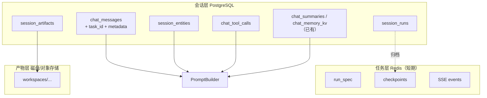
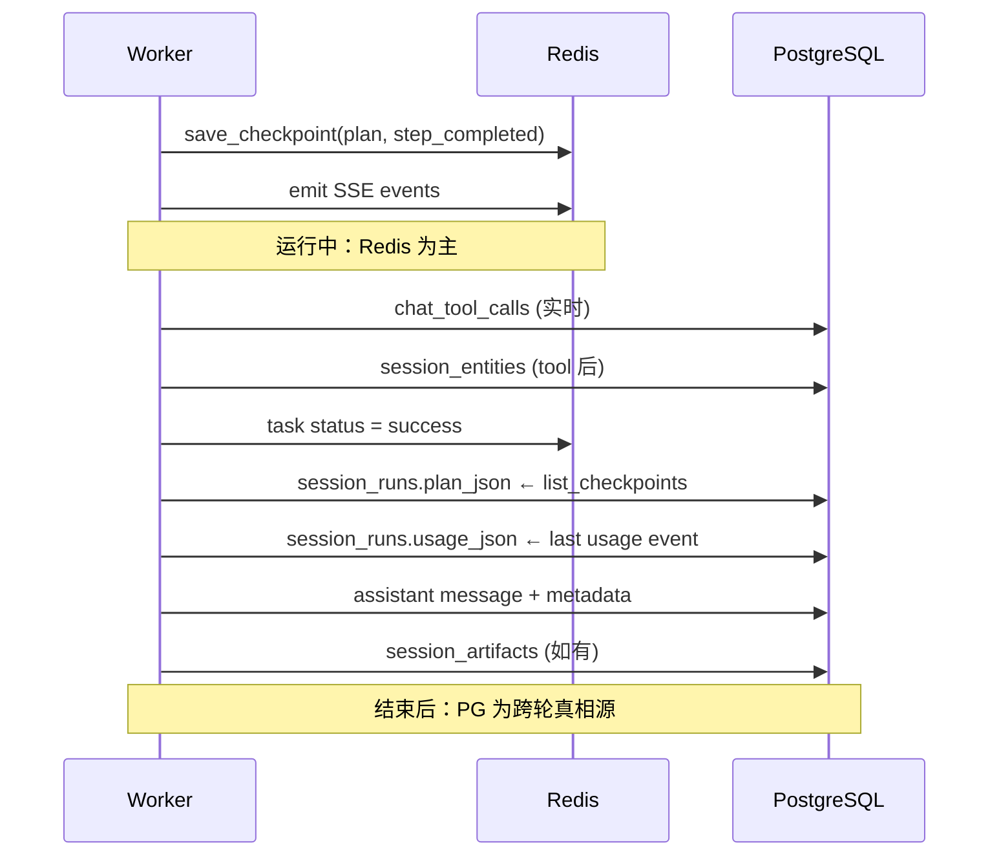

# 多轮对话持久化设计建议

本文档梳理 Agent / API 后端在多轮对话场景下**应持久化哪些数据**、**当前缺口**、**推荐分层模型**与**实施优先级**。与 [用户 Query 全流程](./user-query-flow-zh.md) 互补：前者描述单次请求链路，本文聚焦跨轮状态与记忆。

---

## 1. 设计原则

多轮对话的数据应分三层管理：

| 层级 | 存储 | 生命周期 | 职责 |
|------|------|----------|------|
| **会话层** | PostgreSQL | 长期（天～月） | 对话主线、结构化事实、证据、产物索引 |
| **任务层** | Redis | 短期（小时～天） | 单次 run 的实时状态、SSE、checkpoint、resume |
| **产物层** | 磁盘 / 对象存储 | 长期 | 脚本输出、报告、VCF 等大文件 |

**核心原则：**

- **Redis 管「单次 task 的恢复」**；跨轮记忆必须落 PG，否则 TTL 过期后 agent 会「失忆」。
- **Prompt 不进库**；存 snapshot 摘要与版本号即可。
- **工具 raw 响应不全量存**；存 evidence 摘要 + `raw_ref`（PMID、job_id、文件路径）。
- **Provider API key 不落库明文**；沿用现有 TTL secret + 可选 ciphertext。

---

## 2. 当前已持久化的数据

### 2.1 PostgreSQL（会话层）

| 表 | 主要字段 | 多轮用途 | 代码位置 |
|----|----------|----------|----------|
| `chat_sessions` | tenant_id, user_id, title, status, last_active_at | 会话列表、归属校验 | `app/models/chat_session.py` |
| `chat_messages` | role, content, turn_index, token_estimate, trace_id | 拼 recent messages | `app/models/chat_message.py` |
| `chat_summaries` | summary_text, covered_until_turn, version | 超出 token 预算时的压缩上下文 | `app/models/chat_summary.py` |
| `chat_memory_kv` | key, value, importance, source_turn, expires_at | 跨轮 key-value 事实 | `app/models/chat_memory_kv.py` |
| `spliceai_jobs` | variant_hgvs, status, archived_result, session_id | 异步生信任务结果 | `app/models/spliceai_job.py` |

### 2.2 Redis（任务层）

| Key 模式 | 内容 | 多轮用途 |
|----------|------|----------|
| `task:{id}:state` | TaskState | 运行中状态 |
| `task:{id}:events` | SSE 事件流 | 断线重连（`Last-Event-ID`） |
| `task:{id}:checkpoints` | plan / step 进度 | supervisor resume |
| `task:{id}:run_spec` | agent 运行参数 | resume 重放 |
| `task:{id}:approved_tools` | 已审批工具 | 审批后继续 |
| `secret:{ref}` | Provider API key（TTL） | resume 时恢复密钥 |

代码位置：`app/services/task_manager.py`、`app/api/v1/agents.py`（`save_run_spec`）。

### 2.3 磁盘（产物层）

```
{SCRIPT_WORKSPACE_ROOT}/{tenant_id}/{session_id}/{task_id}/
├── scripts/          # Skill 物化脚本
├── inputs/           # VCF、evidence.json 等
├── outputs/{run_id}/ # stdout/stderr/meta.json
└── .skill_manifest.json
```

工作区按 session/task 隔离，但**产物未在 DB 建索引**，多轮续聊时 agent 无法可靠引用历史文件。

### 2.4 上下文组装链路（现状）

```
chat_messages + chat_summaries + chat_memory_kv
    + skills（关键词解析）+ context_packs（关键词评分）
        → PromptBuilder → AgentContextSnapshot → 下一轮 LLM 输入
```

代码位置：`app/services/prompt_builder.py`、`app/services/context_loader.py`。

---

## 3. 问题与缺口

### 3.1 会话层缺口

| # | 问题 | 影响 |
|---|------|------|
| P1 | **工具调用未入库** | SSE 有 `tool_start`/`tool_end`，但 PG 无记录；多轮无法知道「已查过 NCBI / 已 submit SpliceAI」 |
| P2 | **BioEvidence 仅内存流转** | subagent 收集后在 `to_context_block()` 注入 prompt，step 结束后丢弃 | 
| P3 | **分析对象无结构化存储** | variant/gene/genome_build 靠 `memory_kv` 启发式从 `key: value` 文本提取，不可靠 |
| P4 | **每轮运行元数据未归档** | agent_type、model、context_policy、resolved_skills 只在 Redis `run_spec`，task 结束后丢失 |
| P5 | **message 与 task 未关联** | 无法从某条 assistant 回复反查对应 plan、tool 链、usage |
| P6 | **SpliceAI job 与 turn 弱关联** | job 表有 session_id，但 message 未存 job_id 引用 |
| P7 | **workspace 产物无 DB 索引** | 报告、VCF QC 结果存在磁盘，续聊时 LLM 不知道路径 |

### 3.2 任务层缺口

| # | 问题 | 影响 |
|---|------|------|
| T1 | **checkpoint 无 session 级归档** | Redis 过期后无法回看历史 plan / step 输出 |
| T2 | **supervisor resume 重建 plan** | checkpoint 存了 plan，但 resume 仍调用 `build_plan()`，与旧 step 可能错位 |
| T3 | **子 task 无收尾** | subagent 创建的 child task 未标记 success/failed |

### 3.3 多轮场景覆盖度

| 场景 | 需要的数据 | 现状 |
|------|-----------|------|
| **A. 普通续聊**（「继续」「写详细点」） | messages + summary + 最近 assistant | ✅ 基本够用 |
| **B. Bio 分析续聊**（「同一变异再查文献」「SpliceAI 结果出来了吗」） | variant、evidence、job_id、tool 历史 | ❌ 明显不足 |
| **C. Supervisor 中断 resume** | plan + step outputs + approval | ⚠️ Redis 有，未与 session 绑定；resume 逻辑有 bug |
| **D. 换 model/agent 续聊** | 每轮 agent_type/model 历史 | ❌ 未归档到 session |

---

## 4. 推荐持久化数据清单

### 4.1 必须持久化（PostgreSQL，会话级）

下一轮 prompt 组装**必须能读到**的数据。

| 数据 | 说明 | 建议存储 |
|------|------|----------|
| user / assistant 消息 | 对话主线 | 已有 `chat_messages` |
| 每轮运行元数据 | model、agent_type、context_policy、skill_names、context_pack_ids | 扩展 `chat_messages.metadata` 或新表 `session_runs` |
| 工具调用记录 | tool_name、input 摘要、output 摘要、status、duration | 新表 `chat_tool_calls` |
| 结构化 BioEvidence | 文献、变异、蛋白、splice_score、job 等 | 新表 `session_entities` 或 `session_evidence` |
| 会话级分析对象 | HGVS、gene_symbol、genome_build、vcf_path | 新表 `session_entities`（canonical_id + entity_type） |
| 异步 job 引用 | SpliceAI job_id 与 turn/message 关联 | 扩展 `spliceai_jobs` + message metadata |

### 4.2 应该持久化（PostgreSQL，审计 / 复现）

不一定每轮都进 prompt，但产品需要「回看、审计、复现」。

| 数据 | 说明 |
|------|------|
| 每轮 token usage | input/output tokens，成本与预算 |
| Context snapshot 摘要 | 各层 token 用量、trimmed 项、summary_hit/kv_hit |
| Plan / workflow 归档 | supervisor 的 plan_json、step outputs |
| 审批记录 | 哪轮、哪个 tool、审批人、结果 |
| 产物 artifact 索引 | report、vcf、script_output 的路径 / URI / sha256 |
| Summary 元数据 | 是否 LLM 生成、覆盖哪些 turn / tool_calls |

### 4.3 短期存 Redis（任务级，不必长期 PG）

| 数据 | TTL 建议 | 用途 |
|------|----------|------|
| `run_spec` | 7d | resume、参数重放 |
| `checkpoints` | 7d | supervisor step 恢复 |
| SSE `events` | 1–3d | 断线重连 |
| `approved_tools` | 跟 task | 审批 gate |
| provider secret ref | 600s（已有） | 安全 |

**注意：** task 成功结束时，应将 plan、usage 等**归档到 PG**（`session_runs`），避免 Redis 过期后丢失。

### 4.4 不建议持久化

| 数据 | 原因 |
|------|------|
| 完整 SSE 事件流 | 体积大；保留 tool_call + 最终 assistant 即可 |
| Provider API key 明文 | 安全风险 |
| 全量 tool raw response | 用 evidence 摘要 + raw_ref 代替 |
| 每次完整 prompt 文本 | 过大；存 snapshot 摘要 + 版本号 |

---

## 5. 推荐数据模型

### 5.1 总体架构



### 5.2 表结构建议（草案）

#### 扩展 `chat_messages`

```sql
-- 在现有字段基础上增加
ALTER TABLE chat_messages ADD COLUMN task_id VARCHAR(36);
ALTER TABLE chat_messages ADD COLUMN metadata JSONB DEFAULT '{}';
-- metadata 示例:
-- {
--   "agent_type": "supervisor",
--   "model": "gpt-4.1",
--   "context_policy": "balanced",
--   "skill_names": ["variant-interpretation"],
--   "context_pack_ids": ["domains/variant-analysis"],
--   "usage": {"input_tokens": 1200, "output_tokens": 400}
-- }
```

#### 新表 `chat_tool_calls`

```sql
CREATE TABLE chat_tool_calls (
    id              VARCHAR(36) PRIMARY KEY,
    session_id      VARCHAR(36) NOT NULL REFERENCES chat_sessions(id),
    turn_index      INTEGER NOT NULL,
    task_id         VARCHAR(36) NOT NULL,
    trace_id        VARCHAR(64),
    tool_name       VARCHAR(120) NOT NULL,
    call_id         VARCHAR(36) NOT NULL,
    input_json      JSONB NOT NULL DEFAULT '{}',
    output_json     JSONB,              -- 摘要或完整（小 payload）
    output_ref      VARCHAR(512),       -- 大结果：文件路径 / job_id / URL
    status          VARCHAR(32) NOT NULL,  -- success | failed | pending_approval
    error_code      VARCHAR(64),
    duration_ms     INTEGER,
    created_at      TIMESTAMPTZ NOT NULL DEFAULT now()
);
CREATE INDEX idx_tool_calls_session_turn ON chat_tool_calls(session_id, turn_index);
CREATE INDEX idx_tool_calls_task ON chat_tool_calls(task_id);
```

#### 新表 `session_entities`

```sql
CREATE TABLE session_entities (
    id              SERIAL PRIMARY KEY,
    session_id      VARCHAR(36) NOT NULL REFERENCES chat_sessions(id),
    entity_type     VARCHAR(32) NOT NULL,  -- variant | gene | protein | literature | splice_score | job | vcf
    canonical_id    VARCHAR(255) NOT NULL, -- 如 NM_000518.5:c.694+1G>A
    display_name    VARCHAR(255),
    genome_build    VARCHAR(16),
    source          VARCHAR(64),             -- ncbi | uniprot | spliceai | user
    source_turn     INTEGER,
    source_tool_call_id VARCHAR(36),
    confidence      REAL DEFAULT 1.0,
    summary         TEXT,
    raw_ref         VARCHAR(512),            -- PMID / UniProt acc / job_id
    metadata        JSONB DEFAULT '{}',
    is_active       BOOLEAN DEFAULT TRUE,    -- 当前会话「主分析对象」
    created_at      TIMESTAMPTZ NOT NULL DEFAULT now(),
    updated_at      TIMESTAMPTZ NOT NULL DEFAULT now(),
    UNIQUE(session_id, entity_type, canonical_id)
);
CREATE INDEX idx_session_entities_session ON session_entities(session_id, is_active);
```

#### 新表 `session_runs`

```sql
CREATE TABLE session_runs (
    id              VARCHAR(36) PRIMARY KEY,  -- = task_id
    session_id      VARCHAR(36) NOT NULL REFERENCES chat_sessions(id),
    turn_index      INTEGER,
    user_id         INTEGER,
    tenant_id       VARCHAR(64) NOT NULL,
    trace_id        VARCHAR(64),
    agent_type      VARCHAR(64) NOT NULL,
    model           VARCHAR(64),
    context_policy  VARCHAR(32),
    status          VARCHAR(32) NOT NULL,    -- success | failed | cancelled | awaiting_approval
    plan_json       JSONB,                   -- supervisor plan 归档
    usage_json      JSONB,                   -- token usage
    routing_json    JSONB,                   -- model_router 决策
    resolved_skills JSONB,
    context_pack_ids JSONB,
    error_message   TEXT,
    started_at      TIMESTAMPTZ,
    completed_at    TIMESTAMPTZ,
    created_at      TIMESTAMPTZ NOT NULL DEFAULT now()
);
CREATE INDEX idx_session_runs_session ON session_runs(session_id, created_at DESC);
```

#### 新表 `session_artifacts`

```sql
CREATE TABLE session_artifacts (
    id              VARCHAR(36) PRIMARY KEY,
    session_id      VARCHAR(36) NOT NULL REFERENCES chat_sessions(id),
    turn_index      INTEGER,
    task_id         VARCHAR(36) NOT NULL,
    run_id          VARCHAR(36),             -- script run_id
    kind            VARCHAR(32) NOT NULL,    -- report | vcf | evidence | script_output | spliceai_result
    filename        VARCHAR(255),
    storage_path    VARCHAR(512) NOT NULL,   -- 相对 workspace 或 s3://
    mime_type       VARCHAR(64),
    sha256          VARCHAR(64),
    size_bytes      BIGINT,
    metadata        JSONB DEFAULT '{}',
    created_at      TIMESTAMPTZ NOT NULL DEFAULT now()
);
CREATE INDEX idx_session_artifacts_session ON session_artifacts(session_id, kind);
```

#### 扩展 `spliceai_jobs`

```sql
ALTER TABLE spliceai_jobs ADD COLUMN turn_index INTEGER;
ALTER TABLE spliceai_jobs ADD COLUMN message_id VARCHAR(36);
ALTER TABLE spliceai_jobs ADD COLUMN tool_call_id VARCHAR(36);
```

### 5.3 与现有 `chat_memory_kv` 的分工

| 存储 | 适合存什么 | 不适合存什么 |
|------|-----------|-------------|
| `session_entities` | HGVS、gene、PMID、job_id 等**有类型、可去重**的事实 | 自由文本偏好 |
| `chat_memory_kv` | 用户偏好（「用 GRCh38」「报告要中文」）、临时备注 | 需要精确引用的 bio 实体 |
| `chat_summaries` | 长对话压缩 | 结构化 evidence |
| `chat_tool_calls` | 工具 I/O 与执行状态 | 会话级「当前分析对象」标记 |

---

## 6. 写入时机

| 时机 | 写入内容 | 代码落点（建议） |
|------|----------|------------------|
| `POST /agents/run` | user message；`session_runs` 占位（status=running） | `app/api/v1/agents.py`、`app/worker/tasks.py` |
| Tool 执行成功/失败 | `chat_tool_calls`；更新 `session_entities` | `app/tools/executor.py` 或 hook `POST_TOOL_USE` |
| SpliceAI submit/complete | `spliceai_jobs` + entity(job) + tool_call | `app/services/spliceai_jobs.py` |
| Assistant 完成 | assistant message（含 metadata.usage）；更新 `session_runs` | `app/worker/tasks.py` |
| Task success | plan/checkpoint → `session_runs.plan_json`；artifact 索引 | task 收尾逻辑 |
| 脚本执行完成 | `session_artifacts` + workspace path | `app/services/script_runner.py` |
| 后台 refresh | summary + memory_kv（已有） | `_refresh_session_memory` |

### 6.1 PromptBuilder 读取优先级（建议）

下一轮组装 context 时，按优先级注入：

1. **session_entities**（is_active=true）→ `[ActiveAnalysis]` 块
2. **chat_summaries** → `[SessionSummary]`
3. **chat_memory_kv** → KV 块
4. **最近 N 轮 chat_messages**
5. **最近 M 条 chat_tool_calls 摘要**（避免重复调工具）
6. skills + context_packs（已有）

---

## 7. 实施优先级

### P0 — 多轮 Bio 可用的最低集

1. `chat_messages.metadata`：task_id、agent_type、model、skill_names、usage
2. `chat_tool_calls`：tool_name、input/output 摘要、status
3. `session_entities`：variant / gene / spliceai_job_id

**验收：** 同一 session 第二轮问「SpliceAI 结果出来了吗」，agent 能读到 job_id 与状态，不重复 submit。

### P1 — 可审计、可复现

4. `session_runs`：task 结束时从 Redis 归档 plan + usage + routing
5. `session_artifacts`：workspace 产物索引
6. 扩展 `spliceai_jobs` 与 turn/message 关联

**验收：** Admin / 前端可展示会话时间线（message → tools → artifacts）。

### P2 — 体验与成本

7. Context snapshot 摘要持久化（debug 用）
8. Evidence 去重（同 PMID / 同 HGVS 不重复查）
9. Supervisor checkpoint 归档 + fix resume 不重建 plan

**验收：** 长 session（>20 轮）token 成本可控；supervisor 中断后可精确 resume。

### P3 — 产品化

10. `GET /sessions` 列表 API（`list_sessions` 已有 service，缺路由）
11. `GET /sessions/{id}/timeline` 聚合 message + tool + entity + artifact
12. 会话导出（PDF / JSON evidence pack）

---

## 8. 与相关文档的交叉引用

| 文档 | 关系 |
|------|------|
| [user-query-flow-zh.md](./user-query-flow-zh.md) | ID 体系、Redis key、workspace 路径 |
| [agent-framework-zh.md](./agent-framework-zh.md) | Supervisor、subagent、checkpoint 事件 |
| [TODO.next.md](./TODO.next.md) | 可在此登记 P0/P1 任务 |

---

## 9. 附录：Redis → PG 归档流程



---

## 10. 变更记录

| 日期 | 说明 |
|------|------|
| 2026-05-31 | 初版：现状梳理、缺口、表结构草案、优先级 |
