# 用户 Query 全流程文档

本文描述用户从前端发送一条 query 到收到 Agent 回复的**完整链路**，涵盖 ID 体系、配置项、工具、Skill、沙箱、SSE 事件与异常恢复。

---

## 1. 总览

```mermaid
flowchart TB
    subgraph Client["客户端"]
        U[用户输入 prompt]
        SSE[GET /tasks/{task_id}/stream]
    end

    subgraph API["FastAPI /api/v1"]
        AUTH[JWT 鉴权 + X-Tenant-ID + X-Trace-ID]
        RUN[POST /agents/run]
        RESUME[POST /agents/{task_id}/resume]
    end

    subgraph Store["持久化 / 缓存"]
        PG[(PostgreSQL<br/>session / message / summary / kv)]
        REDIS[(Redis<br/>task state / events / secrets)]
    end

    subgraph Worker["Celery Worker"]
        TASK[agent.run → _run_agent_task]
        CTX[ContextLoader + PromptBuilder]
        HOOK[HookRegistry 生命周期]
        BR{agent_type?}
        SUP[Supervisor 多步工作流]
        OAI[OpenAI Agent 流式]
        BUILTIN[Builtin Agent]
    end

    U --> RUN
    RUN --> AUTH
    AUTH --> PG
    RUN --> REDIS
    RUN --> TASK
    TASK --> CTX
    CTX --> HOOK
    HOOK --> BR
    BR -->|supervisor| SUP
    BR -->|research + LLM| OAI
    BR -->|builtin| BUILTIN
    SUP --> REDIS
    OAI --> REDIS
    BUILTIN --> REDIS
    REDIS --> SSE
    RESUME --> TASK
```

**典型时序（生产环境）：**

1. `POST /api/v1/agents/run` → 同步返回 `task_id` + `stream_url`
2. 客户端立刻订阅 `GET /api/v1/tasks/{task_id}/stream`（SSE）
3. Celery 异步执行 `_run_agent_task`
4. Worker 通过 `task_manager.emit()` 写入事件 → SSE 推送给客户端
5. 任务结束 → `status: success` / `failed` / `awaiting_approval`

---

## 2. ID 与标识符 glossary

| ID / 字段 | 生成位置 | 格式 | 作用域 | 说明 |
|-----------|----------|------|--------|------|
| `user_id` | DB `users.id` | int | 全局 | JWT 中携带，任务 owner |
| `tenant_id` | JWT claim 或 `X-Tenant-ID` | string | 租户 | 多租户隔离；须与 token claim 一致 |
| `trace_id` | Header `X-Trace-ID` 或 API 生成 UUID | UUID | 请求链 | 日志/事件关联；贯穿 task、message、tool |
| `session_id` | DB `chat_sessions.id` | UUID | 会话 | 多轮对话、上下文、workspace 路径 |
| `task_id` | `task_manager.create_task()` | UUID | 单次运行 | 主任务 ID；SSE / checkpoint / run_spec 主键 |
| `child_task_id` | Subagent 创建 | UUID | 子代理 | 子代理工具执行绑定独立 task；共享 `session_id` |
| `subagent_id` | `run_subagent_step()` | UUID | 子代理实例 | 仅事件/审计，非 DB 主键 |
| `event.id` | `task_manager.emit()` 自增 | string | 单 task 事件流 | SSE `Last-Event-ID` 断点续传 |
| `run_id` | `script_runner` | UUID | 脚本单次执行 | 输出目录 `outputs/{run_id}/` |
| `job_id` | SpliceAI submit | UUID | 异步生信任务 | Celery `spliceai.run` 消费 |
| `provider_api_key_ref` | Redis secret | string | 短期 | TTL 默认 600s；resume 可恢复 |
| `plan_version` | Planner | int | 计划 | replan 时递增 |
| `step_id` | Planner | `step_1`… | 工作流步 | checkpoint / handoff 关联 |

**Redis Key 约定（非 test 环境）：**

| Key | 内容 |
|-----|------|
| `task:{task_id}:state` | `TaskState` 哈希 |
| `task:{task_id}:events` | SSE 事件列表 |
| `task:{task_id}:checkpoints` | 工作流 checkpoint JSON |
| `task:{task_id}:run_spec` | 恢复运行所需完整 spec |
| `task:{task_id}:approved_tools` | 已审批工具集合 |
| `secret:{provider_api_key_ref}` | 加密前 API key 明文（TTL） |

**Workspace 路径：**

```
{SCRIPT_WORKSPACE_ROOT}/{tenant_id}/{session_id}/{task_id}/
├── scripts/          # Skill 物化脚本 + 用户脚本
├── inputs/           # VCF、evidence.json 等
├── outputs/{run_id}/ # stdout/stderr/meta.json
└── .skill_manifest.json
```

---

## 3. API 入口：`POST /api/v1/agents/run`

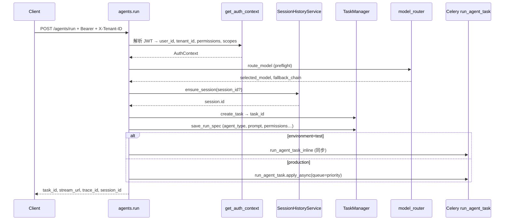

### 3.1 请求体 `AgentRunRequest`

| 字段 | 默认 | 说明 |
|------|------|------|
| `agent_type` | `echo` | 决定工具绑定与执行分支（见 §8） |
| `prompt` | 必填 | 用户 query |
| `model` | `builtin` | 可 `auto` 触发复杂度路由 |
| `priority` | `default` | Celery 队列：`low` / `default` / `high` |
| `session_id` | null | 空则创建新 session |
| `context_policy` | `balanced` | `recent_first` / `summary_heavy` |
| `provider_base_url` | null | 自定义 OpenAI 兼容端点 |
| `provider_api_key` | null | 写入 Redis ref + Fernet  ciphertext |
| `provider_name` | null | 须在 `provider_allowlist` 内 |

### 3.2 响应体 `AgentRunResponse`

```json
{
  "task_id": "550e8400-e29b-41d4-a716-446655440000",
  "stream_url": "/api/v1/tasks/{task_id}/stream",
  "status_url": "/api/v1/tasks/{task_id}",
  "queue": "default",
  "model": "gpt-4.1-mini",
  "session_id": "...",
  "context_policy": "balanced",
  "tenant_id": "lab-a",
  "trace_id": "..."
}
```

### 3.3 鉴权 Headers

| Header | 必填 | 说明 |
|--------|------|------|
| `Authorization` | 是 | `Bearer {access_token}` |
| `X-Tenant-ID` | 否 | 必须与 JWT `tenant_id` claim 一致 |
| `X-Trace-ID` | 否 | 不传则由服务端生成 |

默认 token permissions（可配置 `ACCESS_TOKEN_DEFAULT_PERMISSIONS`）：

- `session:read`
- 生信工具还需：`bio:ncbi:read`, `bio:uniprot:read`, `bio:spliceai:submit`, `bio:spliceai:read`, `bio:script:run`
- 高风险：`http:external`, `mcp:invoke`

---

## 4. Worker 主流程：`_run_agent_task`

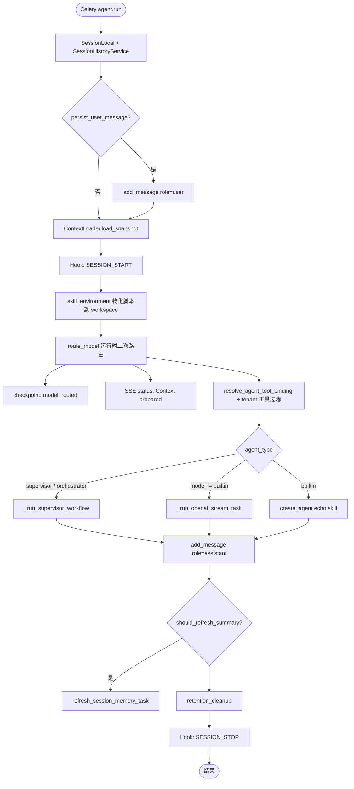

**关键代码路径：**

- 入口：`app/worker/tasks.py` → `_run_agent_task`
- 上下文：`app/services/context_loader.py` → `PromptBuilder.build`
- 事件：`app/services/task_manager.py` → `emit` / `stream_events`

---

## 5. 上下文构建（Context Pipeline）

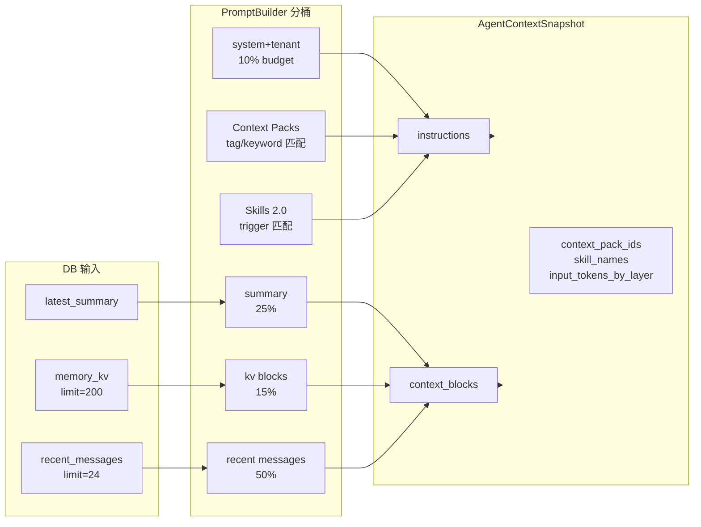

### 5.1 Token Budget 配置

| 配置项 | 默认 | 含义 |
|--------|------|------|
| `CONTEXT_BUDGET_TOKENS` | 4000 | 总预算 |
| `CONTEXT_RATIO_SYSTEM_TENANT` | 0.10 | system + tenant + packs + skills |
| `CONTEXT_RATIO_SUMMARY` | 0.25 | 会话摘要 |
| `CONTEXT_RATIO_MEMORY_KV` | 0.15 | KV 记忆 |
| `CONTEXT_RATIO_RECENT_MESSAGES` | 0.50 | 最近消息 |
| `CONTEXT_RECENT_MESSAGE_LIMIT` | 24 | DB 拉取条数上限 |
| `CONTEXT_PACK_MAX_SELECTED` | 2 | 最多 domain pack 数 |
| `CONTEXT_PACK_MAX_CHARS` | 2400 | pack 注入字符上限 |

### 5.2 Context Pack 选择逻辑

路径：`context_packs/global/base.md`, `context_packs/domains/*.md`

```mermaid
flowchart TD
    P[用户 prompt] --> SCORE[score_context_pack]
    SCORE --> TAG[Tags 行 keyword 命中 +3]
    SCORE --> DOM[domain_keywords 命中 +2]
    SCORE --> TEN[tenants/{tenant_id} +5]
    SCORE --> GLOBAL[global/base 始终 +1]
    SCORE --> RANK[按 score 排序取 top N]
    RANK --> INJECT[注入 instructions]
```

### 5.3 Skill 2.0 解析

路径：`app/agent/skill_resolver.py` + `app/agent/skill_specs.py` + `skills/*/SKILL.md`

```mermaid
flowchart TD
    P[prompt + agent_type] --> RS[resolve_skills max=2]
    RS --> TRG[triggers 子串匹配 +2/个]
    RS --> AGT[research/supervisor +1]
    RS --> TOP[取得分最高 skill]
    TOP --> DISK[加载 skills/{name}/SKILL.md]
    DISK --> INS[build_skill_instructions]
    TOP --> HOOK[SESSION_START 物化 bundled_scripts]
    HOOK --> WS[workspace/scripts/*.py]
    HOOK --> MAN[.skill_manifest.json]
```

**当前 7 个 Skill：**

| name | subagent_role | 主要工具 | default_script |
|------|---------------|----------|----------------|
| variant-interpretation | research_worker | ncbi, uniprot, spliceai | summarize_evidence.py |
| protein-lookup | research_worker | uniprot | — |
| splice-analysis | analysis_worker | spliceai, script_runner | check_hgvs.py |
| literature-triage | research_worker | ncbi | — |
| vcf-qc | analysis_worker | script_runner | vcf_qc.py |
| report-synthesis | report_worker | script_runner, summarize | build_report.py |
| cohort-gene-search | research_worker | ncbi, uniprot | — |

---

## 6. 模型路由（Model Router）

**两次调用：**

1. API preflight（`agents.run`）— 决定 `create_task.model`
2. Worker runtime（`_run_agent_task`）— 基于完整 `model_input` 再次确认

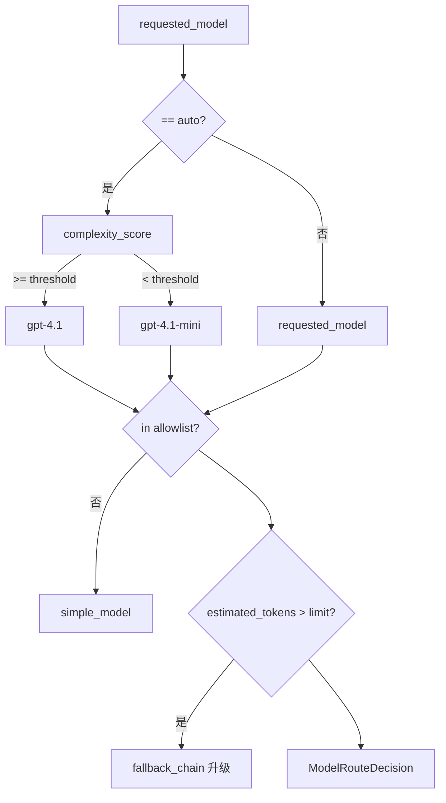

| 配置项 | 默认 |
|--------|------|
| `MODEL_ALLOWLIST` | builtin,gpt-4.1-mini,gpt-4.1 |
| `MODEL_ROUTER_AUTO_ALIAS` | auto |
| `MODEL_ROUTER_SIMPLE_MODEL` | gpt-4.1-mini |
| `MODEL_ROUTER_COMPLEX_MODEL` | gpt-4.1 |
| `MODEL_ROUTER_COMPLEXITY_THRESHOLD` | 6 |
| `MODEL_TOKEN_LIMITS_JSON` | 见 config |
| `MODEL_FALLBACK_CHAINS_JSON` | mini ↔ 4.1 |
| `TENANT_MODEL_POLICIES_JSON` | 租户级模型白名单 |

---

## 7. Agent 类型与工具绑定

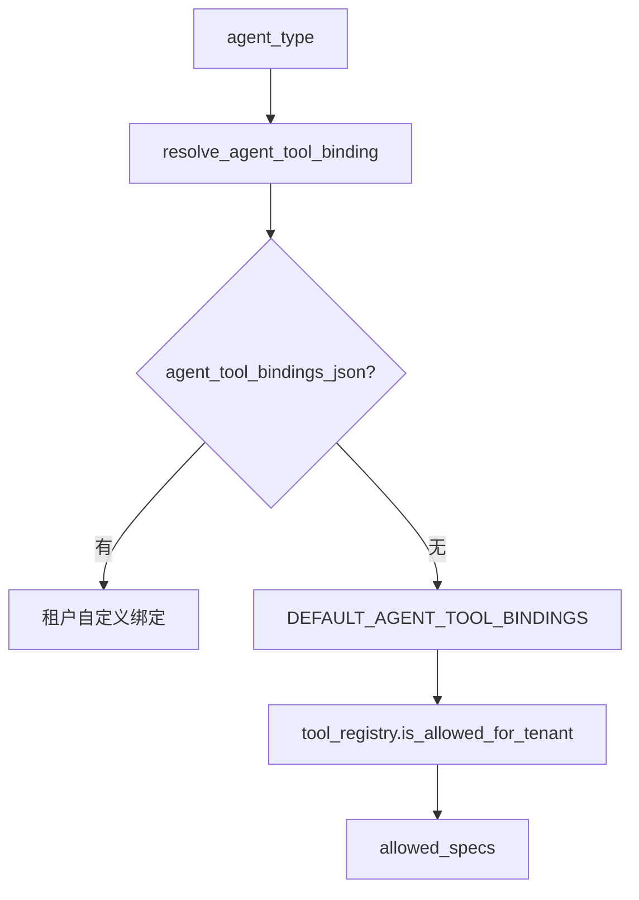

### 7.1 默认工具绑定

| agent_type | tools |
|------------|-------|
| `echo` | time_now |
| `report` | session_lookup, summarize_chunk |
| `research` | session_lookup, bio_*, script_runner, http, mcp |
| `supervisor` | 同 research + summarize_chunk |

覆盖方式：环境变量 `AGENT_TOOL_BINDINGS_JSON`

### 7.2 全量工具清单

| tool_name | required_permissions | risk | 需审批 | safe_for_public |
|-----------|---------------------|------|--------|-----------------|
| time_now | — | low | 否 | 是 |
| session_lookup | session:read | medium | 否 | 是 |
| summarize_chunk | — | low | 否 | 是 |
| bio_ncbi_search | bio:ncbi:read | medium | 否 | 否 |
| bio_uniprot_lookup | bio:uniprot:read | medium | 否 | 否 |
| bio_spliceai_submit | bio:spliceai:submit | high | 否 | 否 |
| bio_spliceai_get_result | bio:spliceai:read | medium | 否 | 否 |
| bio_script_runner | bio:script:run | high | **是** | 否 |
| http_search_wrapper | http:external | high | **是** | 否 |
| mcp_proxy_call | mcp:invoke | high | **是** | 否 |

租户工具策略：`TENANT_TOOL_POLICIES_JSON`  
需审批工具：`TOOL_APPROVAL_REQUIRED_TOOLS`

---

## 8. 执行分支详解

### 8.1 Supervisor / Orchestrator 多步工作流

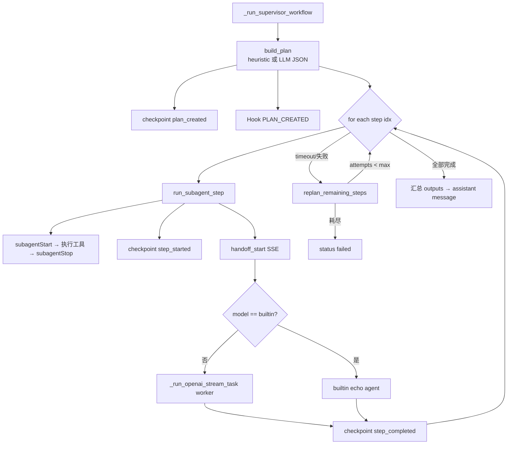

**Planner 配置：**

| 配置项 | 默认 | 说明 |
|--------|------|------|
| `PLANNER_LLM_COMPLEXITY_THRESHOLD` | 6 | 超过则用 LLM planner |
| `PLANNER_LLM_MODEL` | "" | 空则 fallback heuristic |
| `WORKFLOW_STEP_TIMEOUT_SECONDS_DEFAULT` | 45 | 单步超时 |
| `WORKFLOW_STEP_MAX_RETRIES` | 2 | 单步重试 |
| `WORKFLOW_MAX_REPLAN_ATTEMPTS` | 1 | replan 上限 |

**PlanStep 字段：** `step_id`, `title`, `prompt`, `tools`, `depends_on`, `agent_role`, `success_criteria`

### 8.2 Subagent 隔离模型

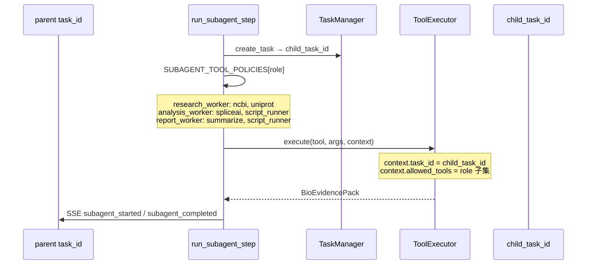

| role | 允许工具 |
|------|----------|
| research_worker | bio_ncbi_search, bio_uniprot_lookup, session_lookup, summarize_chunk |
| analysis_worker | bio_spliceai_*, bio_script_runner, summarize_chunk |
| report_worker | summarize_chunk, session_lookup, bio_script_runner |

### 8.3 OpenAI Agent 流式（research / supervisor worker）

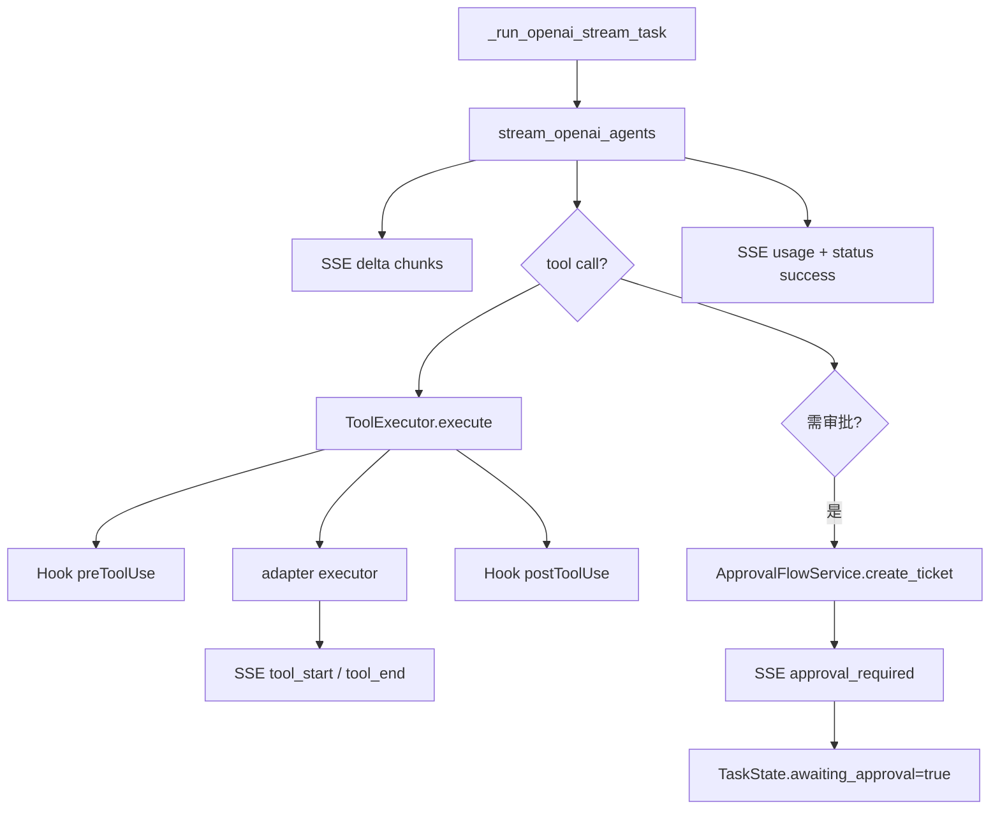

Provider 相关 ID 写入 checkpoint `model_routed`：

- `provider_name`（allowlist 校验）
- `provider_base_url_redacted`
- `provider_api_key_ref` / `provider_api_key_ciphertext`

### 8.4 Builtin Agent（model=builtin）

- `create_agent(task_id, agent_type=skill, model=builtin)`
- 仅 emit `delta` / `part` / `usage` / `status`
- 不调用 OpenAI；supervisor 下 worker 也用 echo 兜底

---

## 9. 工具执行流水线

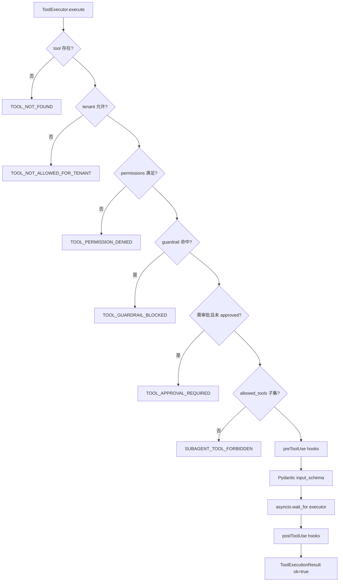

**Hook 事件（`HookRegistry`）：**

| Event | 触发点 | 典型校验 |
|-------|--------|----------|
| sessionStart | 上下文就绪后 | 物化 skill scripts |
| sessionStop | 任务结束 | 可选 cleanup workspace |
| planCreated | 计划生成后 | — |
| subagentStart | 子代理启动 | research 禁止 script_runner |
| subagentStop | 子代理结束 | — |
| preToolUse | 工具调用前 | HGVS 校验、subagent 工具白名单 |
| postToolUse | 工具返回后 | evidence schema、genome_build |
| preScriptRun | 脚本执行前 | script_name、runtime、manifest 白名单 |
| postScriptRun | 脚本结束后 | exit_code != 0 抛错 |

---

## 10. 脚本沙箱（bio_script_runner）

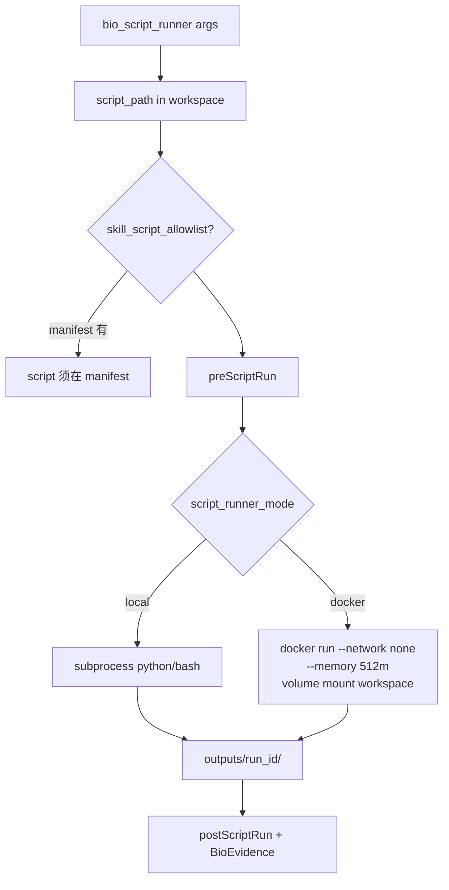

| 配置项 | 默认 |
|--------|------|
| `SCRIPT_WORKSPACE_ROOT` | workspaces |
| `SCRIPT_RUNNER_MODE` | local |
| `SCRIPT_RUNNER_TIMEOUT_SECONDS` | 120 |
| `SCRIPT_RUNNER_MAX_OUTPUT_BYTES` | 50000 |
| `SCRIPT_RUNNER_DOCKER_IMAGE` | python:3.12-slim |
| `SCRIPT_RUNNER_DOCKER_MEMORY` | 512m |
| `SCRIPT_RUNNER_DOCKER_NETWORK` | none |
| `SKILLS_ROOT` | skills |
| `SKILL_MATERIALIZE_ON_SESSION_START` | true |
| `SKILL_SCRIPT_ALLOWLIST_ENABLED` | true |

**环境变量注入脚本：**

- `BIO_WORKSPACE` — workspace 根目录
- `BIO_OUTPUT_DIR` — 本次 run 输出目录
- `BIO_TENANT_ID`, `BIO_TASK_ID`

---

## 11. SpliceAI 异步任务（旁路）

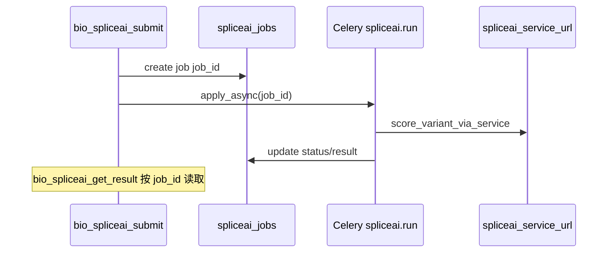

| 配置项 | 说明 |
|--------|------|
| `SPLICEAI_SERVICE_URL` | 生产真实服务；test 用 mock |
| `SPLICEAI_SERVICE_TIMEOUT_SECONDS` | 60 |

---

## 12. SSE 事件流

**订阅：** `GET /api/v1/tasks/{task_id}/stream`  
**Header：** `Last-Event-ID` 断点续传  
**心跳：** `SSE_HEARTBEAT_SECONDS=15`

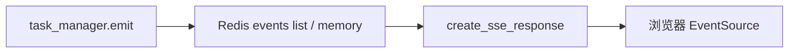

### 12.1 事件类型 `EventType`

| type | 典型 payload 字段 |
|------|-------------------|
| status | status, message, trace_id, tenant_id, session_id |
| delta | chunk |
| part | name=final_text, content |
| usage | input_tokens, output_tokens |
| tool_start / tool_end | tool_name, call_id, duration_ms |
| tool_error | error_code, message, retryable |
| handoff_start / handoff_end | from_agent, to_agent, workflow_step |
| subagent_started / subagent_completed | subagent_id, child_task_id, role |
| approval_required | tool_name, ticket_id |
| step_timeout | workflow_step, retry_count |
| checkpoint_saved | workflow_step, worker |

### 12.2 TaskState 状态机

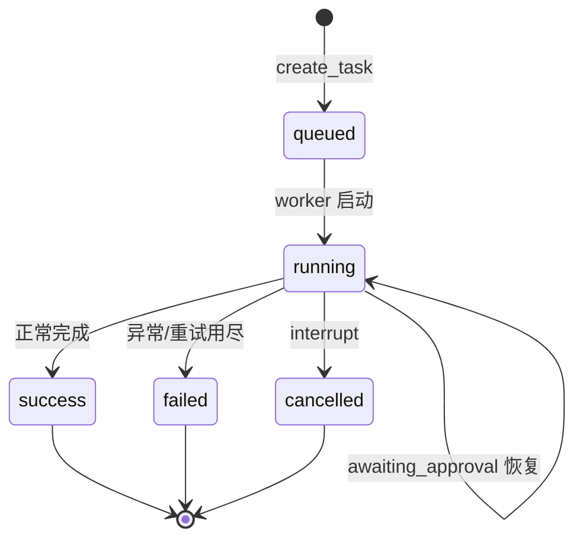

---

## 13. 恢复与审批：`POST /agents/{task_id}/resume`

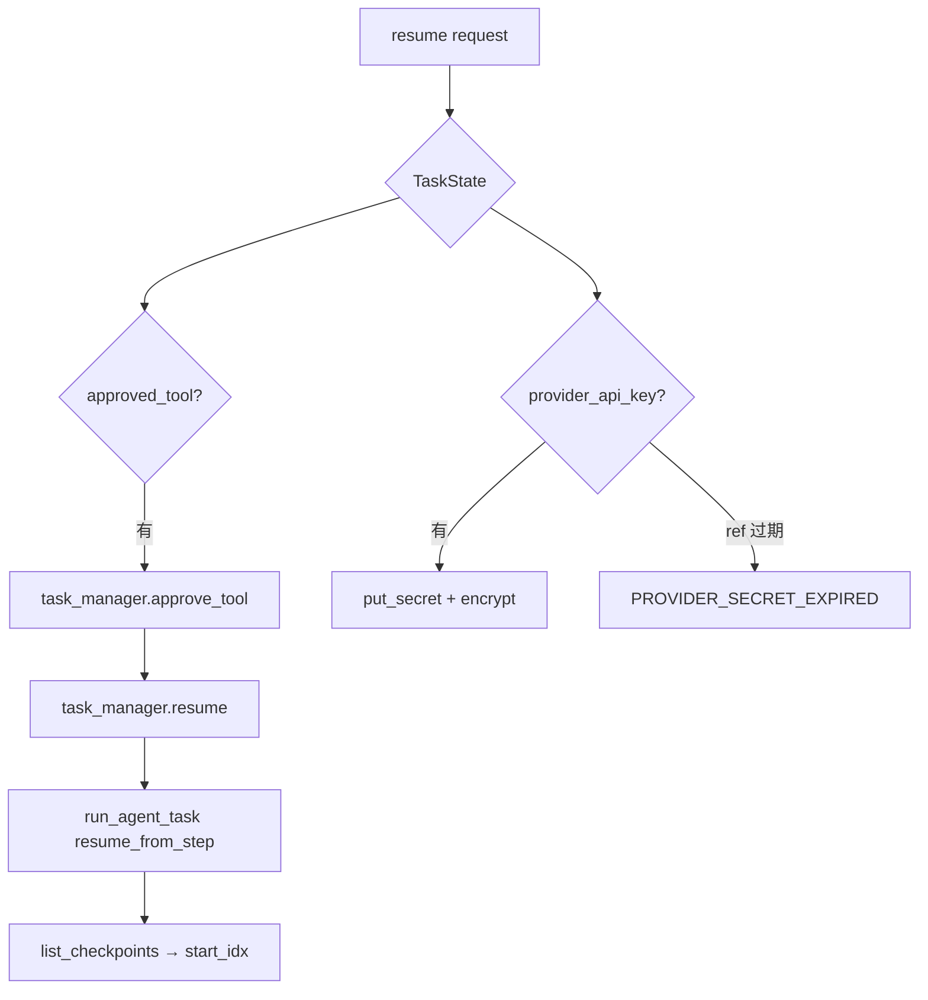

| 字段 | 说明 |
|------|------|
| `resume_from_step` | 从第 N 步继续（supervisor） |
| `approved_tool` | 批准高风险工具后继续 |
| `provider_api_key` | 重新注入 provider secret |

---

## 14. 会话记忆与清理

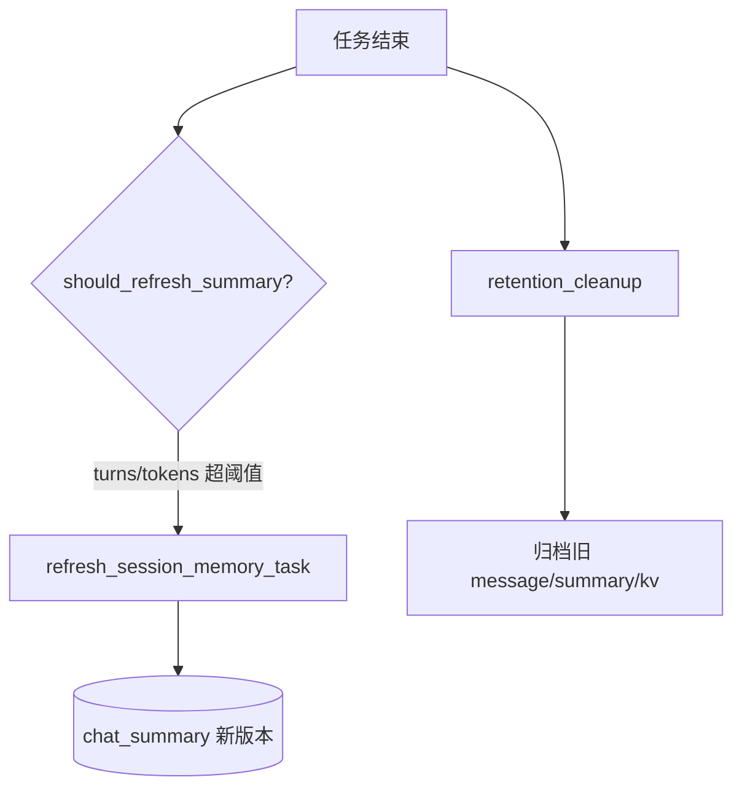

| 配置项 | 默认 |
|--------|------|
| `SUMMARY_TRIGGER_TURNS` | 8 |
| `SUMMARY_TRIGGER_TOKEN_THRESHOLD` | 2000 |
| `MAX_MESSAGES_PER_SESSION` | 2000 |
| `MAX_KV_PER_SESSION` | 200 |
| `KV_TTL_HOURS` | 72 |

---

## 15. 端到端示例（生信 variant + splice）

**用户 query：**

```
Gather NCBI evidence for BRCA1 variant NM_007294.3:c.5266dupC.
Assess splice impact with SpliceAI.
```

**agent_type：** `supervisor`  
**tenant_id：** `lab-a`

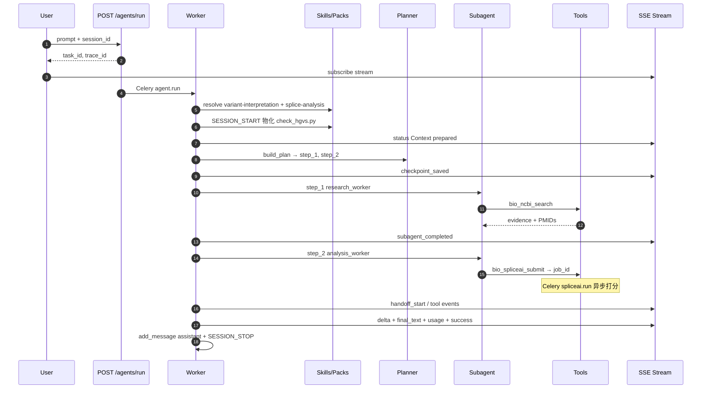

**本例涉及 ID：**

- 1× `task_id`（主任务）
- 2× `child_task_id`（每步 subagent）
- 2× `subagent_id`
- 1× `job_id`（SpliceAI）
- 共享 `session_id`, `trace_id`, `tenant_id`

---

## 16. 配置速查（环境变量）

| 分类 | 变量名 | 默认值 |
|------|--------|--------|
| 基础 | `ENVIRONMENT` | dev |
| | `API_V1_PREFIX` | /api/v1 |
| | `REDIS_URL` | redis://localhost:6379/0 |
| 鉴权 | `JWT_SECRET_KEY` | dev-insecure… |
| | `ACCESS_TOKEN_DEFAULT_TENANT` | public |
| | `ACCESS_TOKEN_DEFAULT_PERMISSIONS` | session:read |
| Celery | `CELERY_TASK_MAX_RETRIES` | 3 |
| 工作流 | `WORKFLOW_STEP_TIMEOUT_SECONDS_DEFAULT` | 45 |
| | `WORKFLOW_MAX_REPLAN_ATTEMPTS` | 1 |
| 上下文 | `CONTEXT_BUDGET_TOKENS` | 4000 |
| 模型 | `MODEL_ALLOWLIST` | builtin,gpt-4.1-mini,gpt-4.1 |
| 工具 | `TOOL_APPROVAL_REQUIRED_TOOLS` | http,mcp,bio_script_runner |
| | `TENANT_TOOL_POLICIES_JSON` | {} |
| | `AGENT_TOOL_BINDINGS_JSON` | {} |
| 沙箱 | `SCRIPT_RUNNER_MODE` | local |
| | `SKILL_MATERIALIZE_ON_SESSION_START` | true |
| SpliceAI | `SPLICEAI_SERVICE_URL` | "" |
| OTEL | `OTEL_ENABLED` | false |

---

## 17. 相关源码索引

| 模块 | 路径 |
|------|------|
| API 入口 | `app/api/v1/agents.py` |
| SSE | `app/api/v1/tasks.py` |
| 鉴权 | `app/api/deps.py` |
| Worker 主流程 | `app/worker/tasks.py` |
| 上下文 | `app/services/context_loader.py`, `prompt_builder.py` |
| Context Pack | `app/services/context_pack_loader.py`, `context_packs/` |
| Skill | `app/agent/skill_specs.py`, `skill_resolver.py`, `skills/` |
| Skill 环境 | `app/services/skill_environment.py` |
| 沙箱 | `app/services/script_sandbox.py`, `script_runner.py` |
| Planner | `app/agent/planner.py`, `llm_planner.py` |
| Subagent | `app/agent/subagent_runner.py` |
| 工具 | `app/tools/__init__.py`, `executor.py` |
| Hooks | `app/agent/hooks.py`, `hook_registry.py` |
| 任务状态 | `app/services/task_manager.py` |
| 模型路由 | `app/services/model_router.py` |
| 配置 | `app/core/config.py` |

---

## 18. 调试检查清单

1. **401/403** — JWT、`X-Tenant-ID` 与 claim 是否一致；task 是否属于当前 user
2. **TOOL_PERMISSION_DENIED** — token 是否含 `bio:*` permissions
3. **TOOL_NOT_ALLOWED_FOR_TENANT** — `TENANT_TOOL_POLICIES_JSON`；`safe_for_public_tenant`
4. **TOOL_APPROVAL_REQUIRED** — 调用 `POST /agents/{task_id}/resume` + `approved_tool`
5. **SCRIPT_NOT_ALLOWED** — skill 是否物化；脚本是否在 `.skill_manifest.json`
6. **无 SSE** — Redis 连接；`task_id` 是否正确；是否订阅 `/tasks/{id}/stream`
7. **Supervisor 卡住** — 查看 `step_timeout` 事件；checkpoint `step_started` / `step_completed`
